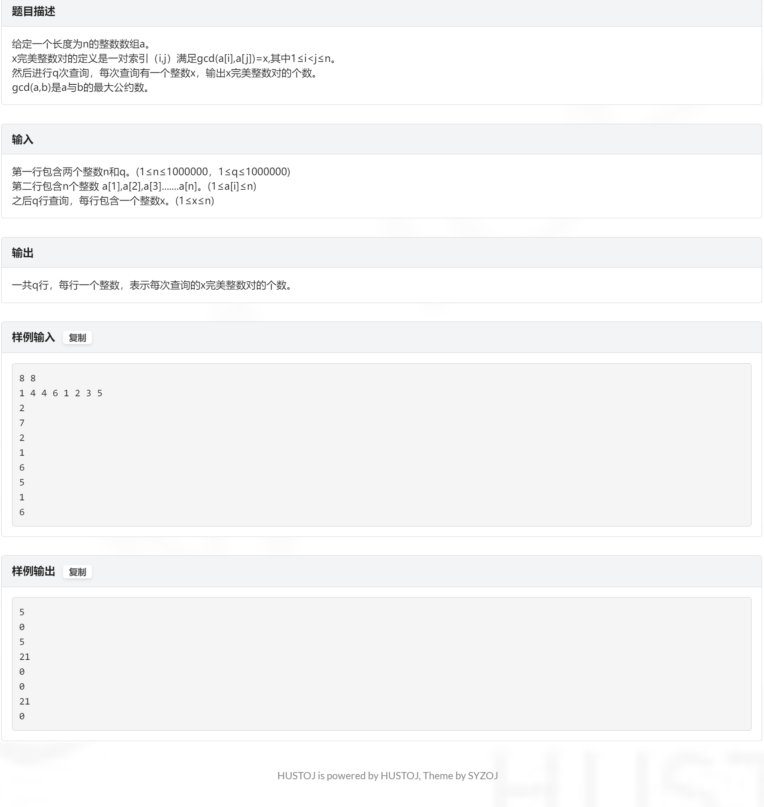

# J 
![[img.png]]

> Floyd 算法跑一遍就ok
```c++
#include <bits/stdc++.h>

#define int long long
#define endl '\n'
const int INF = 1e9 + 50;

void solve() {
    int n, m;
    std::cin >> n >> m;
    std::vector<std::vector<long long> > a(n + 1, std::vector<int>(n + 1, INF));
    long long s[55][55][55];
    memset(s, INF, sizeof s);
    for (int i = 0; i < m; i++) {//建图
        int u, v, w;
        std::cin >> u >> v >> w;
        a[u][v] = std::min(w, a[u][v]);
    }
    auto floyd = [&] {//j->k长度为i的路径
        for (int i = 1; i < n; i++) {//长度
            for (int j = 1; j <= n; j++) {//A
                for (int k = 1; k <= n; k++) {//B
                    if(i == 1) 
                        s[1][j][k] = a[j][k];
                    if (j != k)
                        for (int l = 1; l <= n; l++) {//中间节点
                            if (l == i || l == j)
                                continue;
                            s[i][j][k] = std::min(s[i][j][k], s[i - 1][j][l] + a[l][k]);
                        }
                }
            }
        }
    };
    floyd();
    int q;
    std::cin >> q;
    while (q--) {
        int A, B;
        bool f = false;
        std::cin >> A >> B;
        double ans = 0;
        for (int i = 1; i < n; i++) {
            if (s[i][A][B] - INF <= 0) {
                if (!f) {
                    f = true;
                    ans = (double) s[i][A][B] / (double) i;
                } else
                    ans = std::min(ans, (double) s[i][A][B] / (double) i);
            }
        }
        if (f)
            std::cout << std::fixed << std::setprecision(3) << ans << endl;
        else
            std::cout << "OMG!" << endl;
    }
}

signed main() {
    std::ios::sync_with_stdio(false);
    std::cin.tie(nullptr), std::cout.tie(nullptr);
    int Lazy_boy_ = 1;
    // std::cin >> Lazy_boy_;
    while (Lazy_boy_--)
        solve();
    return 0;
}
```

# A
![[img1.png]]

> 判断两年是否均为闰年或平年,并且这两年的第一天均为周一

```c++
#include <bits/stdc++.h>

#define int long long
#define endl '\n'
const int INF = 0x3f3f3f3f;

void solve() {
    int n;
    std::cin >> n;
    auto calc = [&] (int x){
        if(x % 400 == 0 || (x % 100 != 0 && x % 4 ==0))
            return 366;
        return 365;
    };
    int s = 0;
    for(int i = n;;i ++){
        s += calc(i);
        if(s % 7 == 0 && calc(i + 1) == calc(n)){
            std::cout << i + 1 << endl;
            return;
        }
    }
}

signed main() {
    std::ios::sync_with_stdio(false);
    std::cin.tie(nullptr), std::cout.tie(nullptr);
    int Lazy_boy_ = 1;
    // std::cin >> Lazy_boy_;
    while (Lazy_boy_--)
        solve();
    return 0;
}
```

# E


> dp
```c++
#include <bits/stdc++.h>

#define int long long
#define endl '\n'
const int INF = 0x3f3f3f3f;

void solve() {
    int n, q;
    std::cin >> n >> q;
    std::vector<int> a(n + 1, 0ll);
    // std::map<int ,int> mp;
    std::vector<int> mp(n + 1, 0ll);
    for(int i = 1 ; i <= n ; i ++){
        std::cin >> a[i];
        mp[a[i]] ++;
    }
    std::vector<int> w (n + 1, 0ll);
    for(int i = 1; i <= n ; i ++){
        int s = 0;
        for(int j = i; j <= n ; j += i)
            s += mp[j];
        w[i] = (s - 1) * s / 2;
    }

    for(int i = n ; i >= 1; i --){
        for(int j = 2 * i ; j <= n; j += i)
            w[i] -= w[j];
    }
    while(q --){
        int x;
        std::cin >> x;
        std::cout << w[x] << endl;
    }
}

signed main() {
    std::ios::sync_with_stdio(false);
    std::cin.tie(nullptr), std::cout.tie(nullptr);
    int Lazy_boy_ = 1;
    // std::cin >> Lazy_boy_;
    while (Lazy_boy_--)
        solve();
    return 0;
}
```
